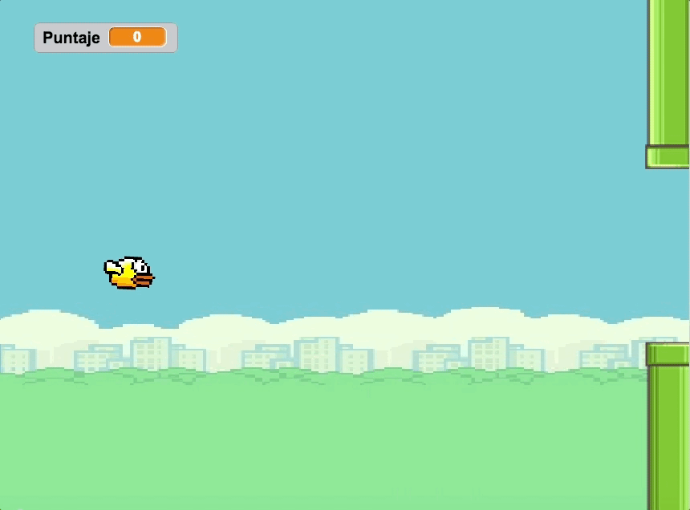
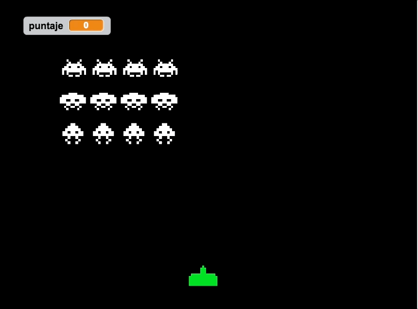

<section>

# Workshop Scratch

## Actividad Presencial

En la siguiente actividad presencial utilizarás todo lo aprendido dentro de la experiencia online para construir un juego desde cero en la plataforma Scratch.

Participar de esta actividad juego te entregará conocimientos prácticos en estructuras de control y algoritmos, los cuales son utilizados a diario en el desarrollo de software.

Para esta actividad existen 3 posibles juegos que puedes construir, cada uno de ellos propone un reto especial y diferente, sin embargo, las dificultades de construcción son distintas para cada uno de ellos.

Los juegos disponibles son (desde el más fácil al más difícil):

-	Flappy Bird.
-	Space Invaders.
- 	Frogger

Para escoger, la recomendación más sencilla consiste en evaluar que tan difícil se hicieron las capsulas de videos previos de aprendizaje tanto a ti como al resto del equipo.

Luego de elegir, los equipos podrán descargar desde el siguiente [link]( https://www.amazon.com/clouddrive/share/bmE3FhbcT57uP6GODYORnc0vFuQBMA3e9SkAofoYFlv) los archivos necesarios para comenzar a crear el juego.

Estos descargables contienen:

- Sprites con los personajes del juego.
- Escenario/s del videojuego.
- Instrucciones para usarlos dentro de scratch.

Terminando la descarga, el equipo deberá crear o iniciar sesión dentro de [https://scratch.mit.edu/](https://scratch.mit.edu/). 

Con la sesión creada, el siguiente paso consiste en crear un proyecto con el nombre del videojuego seleccionado junto con el nombre del equipo, seguido por la integración de los descargables dentro del proyecto de Scratch.

### Requerimientos por juego

#### Flappy

1. Agregar el escenario principal y el personaje principal.
- Al empezar el juego el usuario deberá sufrir el efecto de la gravedad.
- Al presionar la tecla espacio el personaje deberá impulsarse.
- Agregar un tubo contra el cual se pueda chocar.
- Agregar múltiples instancias del tubo y que se generen a medida que avanzas.

#### Space Invaders

1. Agregar el personaje principal y el movimiento lateral.
- Agregar la opción de disparar al presionar la tecla espacio
- Utilizar distintas instancias de la bala para que se pueda disparar más de una vez.
- Agregar un sprite de marciano que se mueva de derecha a izquierda, anima el movimiento.
- Agrega la capacidad de que el marciano pueda disparar
- Agrega todos los clones de marciano.
- Controla la máxima cantidad de balas que puedes disparar y la de los marcianos para ajustar la dificultad.
- El jugador principal debe tener 3 vidas, después de recibir una bala debe perder una vida.
- El jugador principal al quedarse sin vidas debe perder. (pantalla de game over)
- Al matar a todos los marcianos debes pasar al siguiente nivel. (utilizar otra variable para guardar el nivel)
- Los marcianos deben incrementar ligeramente la velocidad.
- Agregar los protectores de balas anti marcianas.

#### Frogger

1. Agregar el escenario principal y de game over.
- Al presionar la flecha izquierda, derecha, arriba y abajo, el personaje principal deberá moverse.
- Agregar los obstáculos del personaje principal.
- Al empezar el juego, los obstáculos deberán moverse por la calle de izquierda a derecha y viceversa. *(dependiendo de tu elección)*
- El personaje al tocar los obstáculos deberá perder y regresar al inicio.
- Agregar los troncos, tortugas, planta del loto y pasto.
- El personaje principal, al tocar los troncos y las tortugas deberá quedarse arriba de ellos hasta que el usuario decida mover la rana a la siguiente plataforma.
- el personaje principal al llegar a la planta del loto deberá quedar el siguiente 
- El personaje principal no debe tocar el pasto, si lo toca debe volver al inicio.
- 
 
Al finalizar el desarrollo del videojuego, un **representante del equipo deberá presentar el videojuego en no más de 3 minutos** y explicar:

-	¿Por qué eligieron este juego?
-	Lógica del juego.
-	¿Cuál fue la mayor dificultad al crear este juego?
-	¿Qué mejoras o funcionalidades podrían implementar dentro del juego a futuro?

**Es importante saber que la demostración del videojuego no requiere del uso de presentaciones visuales (si los equipos lo desean, lo podrán hacer)**.

Las revisiones del proyecto serán evaluadas en conjunto por los equipos de trabajo que no estén presentando, es decir, cada grupo decidirá el puntaje a través de la siguiente [rúbrica](https://goo.gl/1u9e5f).

